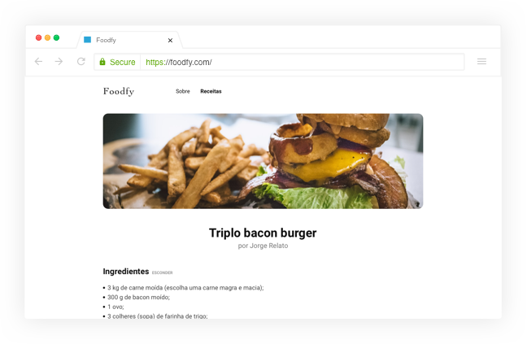
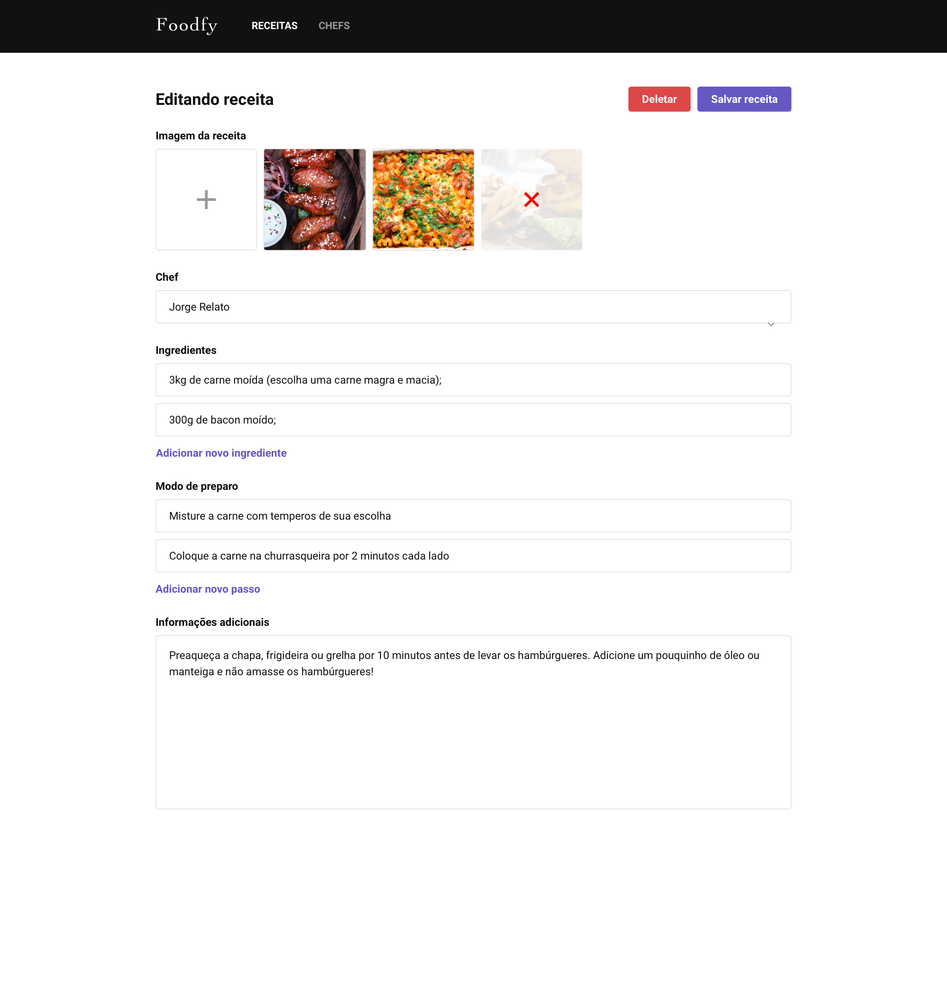

<br>

<div align="center" id="top"> 
  

  &#xa0;
  
</div>

<p align="center">
  

  

  

  
</p>

<p align="center">
  <a href="#preview">Preview</a> &#xa0; | &#xa0;
  <a href="#sparkles-features">Features</a> &#xa0; | &#xa0;
  <a href="#rocket-technologies">Technologies</a> &#xa0; | &#xa0;
  <a href="#white_check_mark-requirements">Requirements</a> &#xa0; | &#xa0;
  <a href="#checkered_flag-starting">Starting</a> &#xa0; | &#xa0;
  <a href="#memo-license">License</a> &#xa0; | &#xa0;
  <a href="https://github.com/mb4ndeira" target="_blank">Author</a> 
</p>

<br>

## 📷 Preview ##






## :sparkles: Features ##

:heavy_check_mark: Upload media;\
:heavy_check_mark: Search recipes;\
:heavy_check_mark: Login system with password recovery;\
:heavy_check_mark: Manage recipes, chefs and users;\
:heavy_check_mark: Admin area;

## :rocket: Technologies ##

The following tools were used in this project:

- [Node.js](https://nodejs.org/en/)
- [PostgreSQL](https://www.postgresql.org/)
- [Nunjucks](https://mozilla.github.io/nunjucks/)  

## :white_check_mark: Requirements ##

Before starting :checkered_flag:, you need to have [Git](https://git-scm.com) and [Node](https://nodejs.org/en/) installed.

## :checkered_flag: Starting ##

1. Fork this repository and clone it into the current directory

   ```bash
   git clone https://github.com/mb4ndeira/foodfy
   ```

2. Install dependencies

   ```bash
   npm install
   ```

3. Set up the database

   ```bash
   psql -U <username> -c "CREATE DATABASE foodfy"
   psql -U <username> -d foodfy -f database.sql
   ```

   You can manually import the database.sql to Postbird, remember to create a new database with the name Foodfy.

   ```bash
   -Alter the db.js, located in src/config to match your PostgreSQL settings.    
   -Alter the mailer.js, located in src/lib to match your Mailtrap settings.  
   ```

4. Populate it with Faker.js

   ```bash
   node seed.js
   ```

   ```bash
   Faker generated password: '1',
   All the users generated have administrator privilegies
   ```

5. Fire up the server and watch files

   ```bash
   npm start
   ```

## :memo: License ##

This project is under license from MIT. For more details, see the [LICENSE](LICENSE.md) file.


Made by <a href="https://github.com/mb4ndeira" target="_blank">Matheus Bandeira</a>.

&#xa0;

<a href="#top">Back to top</a>
